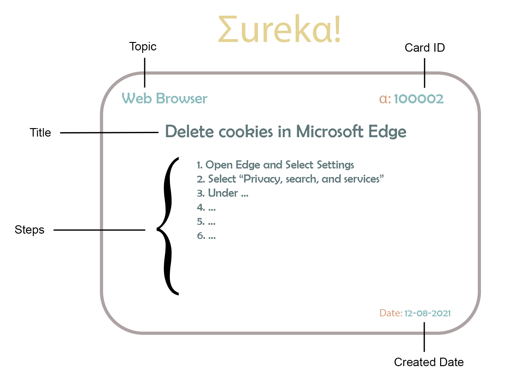

# Eureka!

### Name: Syed Malik

 

## What is `Eureka!`?

---

`Eureka!` is an application where we can go to find the answers to our basics questions. The application will display information in a **catalog card format**. It will store answers to basic questions that any of us have in our daily lives. It will provide a step by step instructions to questions we sometime have when we sit in front of our computers and want a quick answer for. How do we you clear cache in Edge? How to take a screenshot in Windows 10? This application will be your one stop place to find quick concise answers to questions.

  

## Eureka API

---

The `Eureka` API is a ASP.NET Web API that will be utilized to pull the cart catalog information based on the request needed. Users will be able to pull all the information available or query specific information as they need. They will be able to pull information and set a size and page restriction. The API will allow users to serarch by Topic or search keyworks in the Title. The API will also utitlize Entity Framework Core to store the data currently in memory. In a future update will allow for the Migration and store the data in a database locally or in the cloud.

 

## Development

---

- Clone repository
- API uses [localhost:44375](https://localhost:44375)
- CORS Policy added for [localhost:5500](http://localhost:5500) (FrontEnd)
- Nuget Packages utilized:
  - Microsoft.EntityFrameworkCore (5.0.11)
  - Microsoft.EntityFrameworkCore.InMemory (5.0.11)

 

## Query Documentation:

---

The user can use the below as an example of how to pull data from the API.

 

| Query                             | Example                                           |
| --------------------------------- | ------------------------------------------------- |
| Pull all card data                | https://localhost:44375/api/cards                 |
| Set size and page limit           | https://localhost:44375/api/cards?size=4&page=2   |
| Pull data based on specific Topic | https://localhost:44375/api/cards?Topic=Software  |
| Search the Title for key words    | https://localhost:44375/api/cards?Title=Microsoft |

 

## Licence

---

`Eureka!` is [MIT Licenced](LICENSE.md)
